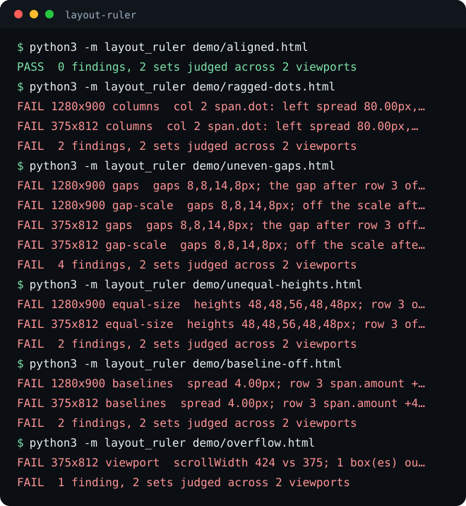

# layout-ruler

layout-ruler renders a web page in headless Chrome, reads the box of every element, and checks the geometry an eye skims past: columns whose edges should line up, gaps that should be equal and on a spacing scale, siblings that should be the same size, text that should share a baseline, and anything that runs off a phone screen. Every finding prints the pixels it measured.




## Install

```bash
pipx install git+https://github.com/eliferres/layout-ruler
layout-ruler page.html
layout-ruler https://example.com/pricing
```

It needs Chrome or Chromium on the machine and nothing else: Python 3.9 or later, standard library only. It is not on PyPI. To run it from a clone instead:

```bash
git clone https://github.com/eliferres/layout-ruler.git
cd layout-ruler
python3 -m layout_ruler demo/ragged-dots.html
```

```text
FAIL 1280x900 columns  col 2 span.dot: left spread 80.00px, right spread 80.00px, centre spread 80.00px; left edges 96,152,112,176,104; rows 1, 2, 3, 4, 5 share no value  [body > ul.list]
FAIL 375x812 columns  col 2 span.dot: left spread 80.00px, right spread 80.00px, centre spread 80.00px; left edges 96,152,112,176,104; rows 1, 2, 3, 4, 5 share no value  [body > ul.list]
FAIL  2 findings, 2 sets judged across 2 viewports
```

`demo/` holds six pages: `aligned.html` passes, and each of the others plants one fault.

## What it checks

There is no spec file to write. The page is walked for repeated sets: a parent with three or more visible element children of one tag (list items, table rows, cards in a grid, links in a nav). Each child is a row, and a row's children are its cells, matched across rows by position and tag. Every rule then reads the boxes of one set.

| Rule | What it catches | Borrowed from, and why |
|---|---|---|
| `columns` | A cell column whose rows share no left edge and no right edge (top or bottom, for a side-by-side set). A leading dot or icon inside a cell is held as its own sub-column. | Galen `aligned vertically left` / `right`. Columns that drift by a few pixels read as sloppy long before anyone can say why. |
| `gaps` | Neighbouring rows that are not the same distance apart. | Galen `below` / `above` with a distance. A list has one rhythm. |
| `gap-scale` | A gap that is not a step of the spacing scale (multiples of 4px unless told otherwise). | The spacing scale of a design system: a value off it is a value nobody chose. |
| `equal-size` | Stacked rows of different heights, or side-by-side rows of different widths. | Galen `width` / `height`. Siblings that look alike should measure alike. |
| `baselines` | Text cells on one line of a row whose baselines differ. | The baseline guide of a design tool. Text that sits a few pixels low beside its label looks broken. |
| `viewport` | Anything wider than the viewport, which on a phone means sideways scrolling. | Galen `inside`. A page that scrolls sideways at 375px is broken there. |
| `screen-height` | With `--screen`, a page taller than the viewport. | For an app screen that must fit without scrolling. |

Each rule allows 1px. A row is left out of `equal-size` when it wraps at that width (a long name on a phone is taller by design), and a first or last row with a different class is treated as a header or footer there. When a rule cannot judge a set (a wrapped grid has no single direction for gaps) it says so in a SKIP row instead of passing silently.

## Usage

```text
layout-ruler [options] PAGE
layout-ruler --probe-json FILE [--probe-json FILE ...]
```

| Option | Meaning |
|---|---|
| `--viewport WxH` | Render at this size; repeatable. Default: `1280x900` and `375x812`. Widths of 480 and under are emulated as a phone (touch, mobile viewport). |
| `--grid PX` | Gaps must be multiples of PX. Default 4. |
| `--scale PX,PX,...` | Gaps must be one of these values; replaces `--grid`. |
| `--screen` | The page must not scroll vertically either. |
| `--all` | Print passing and skipped rows as well as findings. |
| `--json` | Print every row, with its set, rule, measurement and verdict, as JSON. |
| `--chrome PATH` | The browser binary to use. |
| `--cookie NAME=VALUE`, `--header 'NAME: VALUE'` | Sent with the page request; repeatable. |
| `--dump-probe DIR` | Also write the raw measurements of each viewport as JSON. |
| `--probe-json FILE` | Judge recorded measurements instead of rendering. |
| `--version` | Print `layout-ruler <version>`. |

| Exit code | Meaning |
|---|---|
| 0 | No findings. |
| 1 | At least one finding. |
| 2 | The page could not be measured (no Chrome, a missing file, a stylesheet that did not load) or the arguments were wrong. The reason is one line on stderr. |

### Finding Chrome

In order: `--chrome PATH`, then the `LAYOUT_RULER_CHROME` environment variable, then `google-chrome`, `google-chrome-stable`, `chromium`, `chromium-browser` and `chrome` on `PATH`, then the standard macOS application paths for Google Chrome, Chromium and Chrome for Testing. A path given by flag or variable that does not exist is an error, never a reason to fall back to another browser. The GitHub Actions `ubuntu-latest` and `macos-latest` images ship Google Chrome, and the CI here runs the live tests on both.

### Declaring exceptions in the page

A layout that varies on purpose says so with a `data-ruler` attribute, and every declaration is listed in the output as an allow:

| Attribute | Effect |
|---|---|
| `data-ruler="off"` | Skip this element and everything inside it (a designed stagger, an embed). |
| `data-ruler="vary-height"` / `"vary-width"` | On a set's parent: its rows differ in that dimension by design. |
| `data-ruler="screen"` | On `html` or `body`: the same as `--screen`. |
| `data-ruler="root"` | On a lone wrapper under `body`: treat it as `body` (frameworks with an unusual mount id). |

## How it works

The story it was built on: a five-row list where each row was its own CSS grid with an `auto` first column. Each row sized that column to its own name, so the status dot in the next column sat at a different x on every row. It passed several design reviews, because a reviewer looks at a list and nobody measures one. `demo/ragged-dots.html` reproduces it.

- **The vocabulary is Galen's, the measurement is boxes.** The rule names follow the [Galen Framework](https://galenframework.com) spec language. Galen checks the objects a spec file names, through Selenium WebDriver on the JVM; layout-ruler needs no spec, because the defect above is the one nobody thinks to write a spec for. It reads `getBoundingClientRect()` for every element in one script inside the page. Boxes rather than screenshots: a box is an exact number in CSS pixels, with no anti-aliasing to tolerate and an element to name in the finding.
- **Reading through wrappers.** In the story's markup each row was `li > button > [name, status, amount]`. Read literally, each row has one cell (the button) and the ragged column is invisible. So a row whose only child is a wrapper is read through it, down to the cells a reader lines up. The step down stops at a child that is itself a list, which is judged as a set of its own.
- **Standard library only.** Chrome is driven over the DevTools protocol on `--remote-debugging-pipe`: messages are NUL-terminated JSON on file descriptors 3 and 4. A pipe needs no free port, no HTTP handshake and no WebSocket client, so the driver is `os.pipe`, `subprocess`, `json` and one reader thread, and nothing else on the machine can attach to the browser.
- **Measured once the page has settled.** Before the probe runs the page has fired its load event, its fonts are ready, and its finite animations have ended (at least one second, at most six). For lazy content it is scrolled down in steps, re-reading its height at each step so content added near the bottom is scrolled through too, and then every image still loading, lazy ones included, gets up to five seconds to arrive. Every linked stylesheet must have arrived; Chrome hands a failed stylesheet an empty sheet rather than none, so the network events are read too. A page still missing one after a reload with the cache off is exit 2, because measuring browser defaults would report on a page nobody ships. JavaScript dialogs (`alert`, `confirm`, `prompt`) are dismissed as they open, as if the user pressed Cancel, so a page that calls one is still measured.
- **Baselines without font metrics.** A zero-size inline-block sits on the baseline, so its top is the baseline's y. The probe inserts one beside each cell's first text, reads all of them in one layout pass and removes them. Two cells are compared only when their first lines overlap, so a label beside a two-line paragraph pairs with the first line, not the second.
- **The judge is pure.** The probe returns plain JSON and Python judges it. The test suite runs the judge on 97 recorded probes with no browser; the live tests render the demo pages. The probe can be run by another driver (Playwright's `page.evaluate` on `layout_ruler/probe.js`) and its output judged with `--probe-json`.
- **The demo is deterministic by construction.** Every size on the demo pages is a whole CSS pixel and every cell has a fixed width and height, so no number in the transcript depends on the platform's fonts, and the replay test passes on macOS and Linux alike. Baseline findings print offsets rather than absolute y values for the same reason.

## Limitations

- macOS and Linux only. The pipe transport places file descriptors in the child process before it starts, which Windows does not support.
- It needs a local Chrome or Chromium. It does not fetch one.
- Sets are found by heuristics, and some shapes are deliberately not judged: a list built of plain `p` elements reads as prose, the dot, label and count inside an inline pill are not a set of their own, and words in running text are never a set. A layout the heuristics misread can be fenced off with `data-ruler="off"`.
- Shadow DOM and iframes are not entered.
- Overflow is checked horizontally only, unless `--screen` asks for the vertical check.
- Only overflow on the side a page scrolls to is reported: the right in a left-to-right page, the left in a right-to-left one. Anything off the other edge is ignored, which keeps a skip link parked at `left: -9999px` quiet, but also means content pushed off the left by a negative margin is not reported, though nobody can scroll to it.
- Chrome runs with its scrollbars hidden, so the page is laid out as on a phone or a Mac with overlay scrollbars. On a platform whose scrollbars always take space (Windows, Linux by default), an element sized `100vw` is wider than the room left beside the scrollbar and scrolls sideways; the ruler does not see that overflow.
- The tolerance is fixed at 1px, and only the first line of each text cell is read for its baseline.
- Measurements follow the fonts on the machine that renders. The recorded test probes were captured on macOS, which is why the unit tests judge recordings and only the font-independent demo pages are rendered live.
- An animation driven by script that runs longer than six seconds is measured mid-flight, with a note saying so.
- The lazy-content scroll stops 12,000px down, and an image still loading after five seconds is measured as it stands, with a note. Content a script inserts later on its own (on a timer, after a click, from a slow request) is measured only if it has arrived by the time the probe runs.

Contributions are welcome; see [CONTRIBUTING.md](CONTRIBUTING.md). MIT licensed, see [LICENSE](LICENSE).
